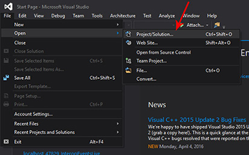
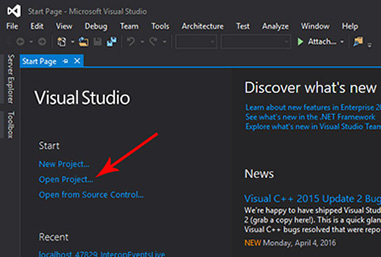
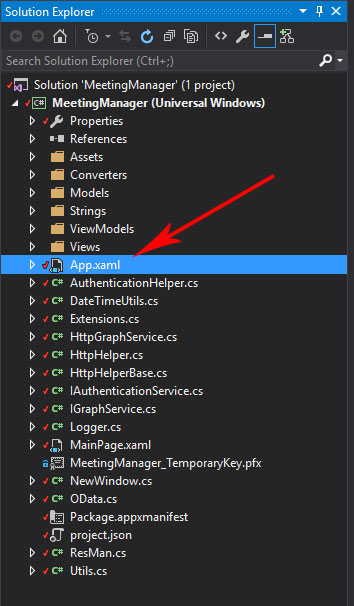
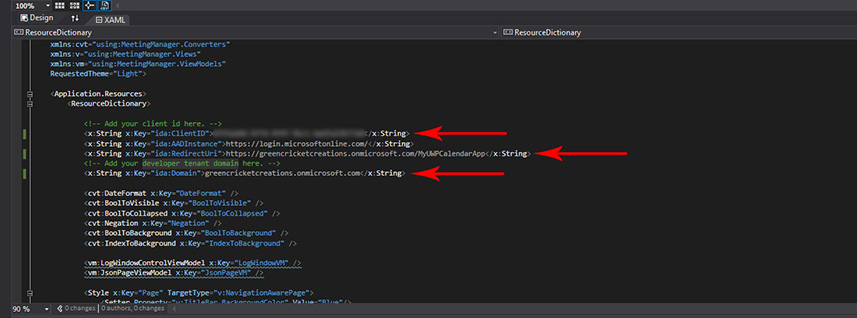
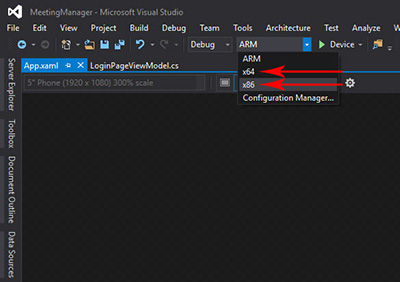
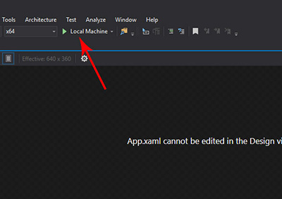
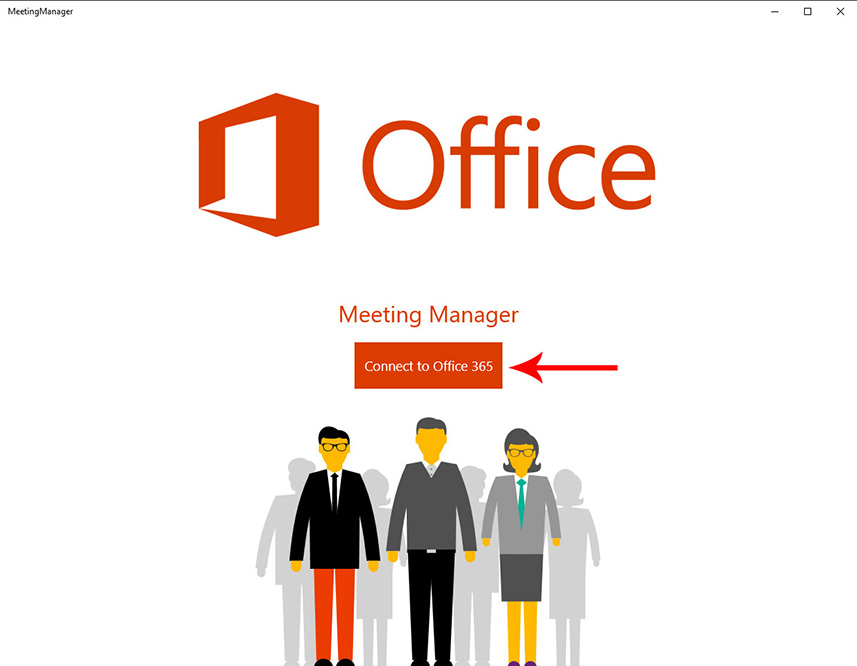
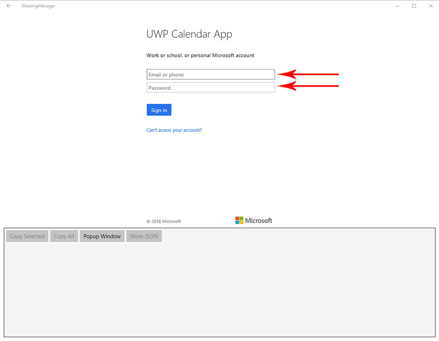
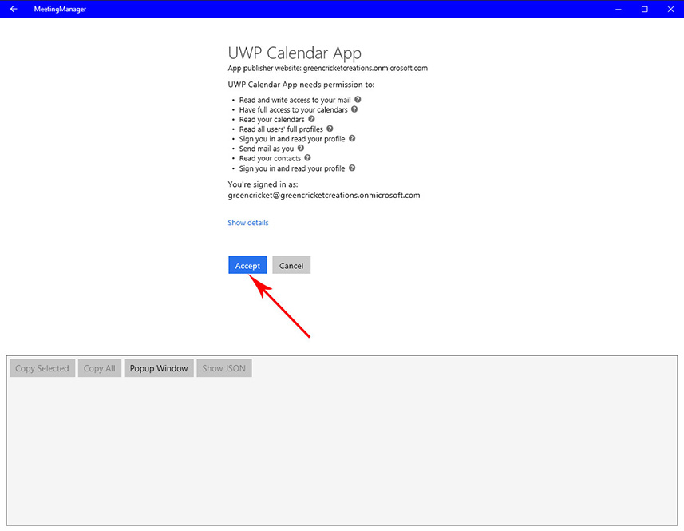
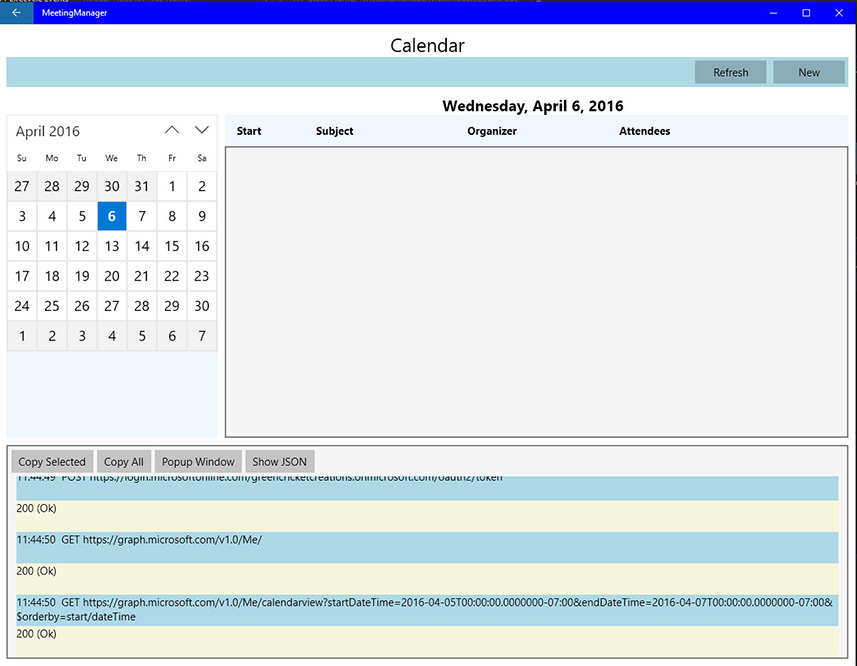

# Interop REST Mail Contacts Calendar App for the Universal Windows Platform

The Universal Windows Platform (UWP) allows developers to build their apps for a wide range of devices including mobile, desktop, HoloLens, Surface Hub, and Xbox. You can learn more about the Universal Windows Platform on the [UWP Quick Start Guide](http://microsoft.github.io/UWPQuickStart/index.html#). 

Before you begin, you need to register your app with an Office 365 Developer account. The directions for registering are in the [README.md file in the root of this repo](../README.md).

##Table of Contents

* [Install Visual Studio](#install-visual-studio)

* [Windows UWP Configuration](#windows-uwp-configuration)

##Install Visual Studio

In order to build the app for the Universal Windows Platform, you need to install Visual Studio 2015 Community (free) or Enterprise (paid). You can download Visual Studio 2015 Community or Enterprise from the [Visual Studio Website](https://www.visualstudio.com/).

##Windows UWP Configuration

1. Download or clone The Interop REST Mail Calendar Android App from the [GitHub repo](https://github.com/OfficeDev/Interop-REST-Mail-Contacts-Calendar-Sample).

2. Start Visual Studio.

3. To open the app, click **file** then hover over Open which will open a new menu and click **Project/Solution** or click **Open Project...** on the start page. Then navigate to the Meeting_Manager_UWP folder \Interop-REST-Mail-Contacts-Calendar-Sample\UWP\Meeting_Manager_UWP and open MeetingManager.sln:

	Open from menu | Open from start page
	--- | ---
	 | 

	#### Select MeetingManage.sln 

	

4. With the project open select **App.xaml** from the Solution Explorer: 

	

5. In the App.xaml file, replace the ClientID with your Client ID, replace the RedirectUri with your Redirect URI and then replace the Domain with your developer tenant domain. For example, I used "https://greencricketcreations.onmicrosoft.com/MyUWPCalendarApp" for my Redirect URI, so my developer tenant domain is "greencricketcreations.onmicrosoft.com": 

	

6. Once you have entered your app registration information, click on the Solution Platforms dropdown on the menu (it's directly left of the green arrow pointing right, see the image below) and choose either **x64** or **x86** depending on your system, then click on **Local Machine** next to the green arrow.

	 | 
	--- | ---

7. Once your app starts, click **Connect to Office 365** and enter your login info from your Office 365 Developer Account then click **Accept** on the next page:

	 |  | 
	--- | --- | ---

8. Your app is now ready to go. You can see the requests and responses from the Microsoft Graph API on the bottom of your screen. If you want to see the JSON values for any of the requests or responses, select the request or response in the console and then click **Show JSON**.

	

9. Your app is now running on the Universal Windows Platform, go make something great!

---

###Copyright

Copyright (c) 2016 Microsoft. All rights reserved.
